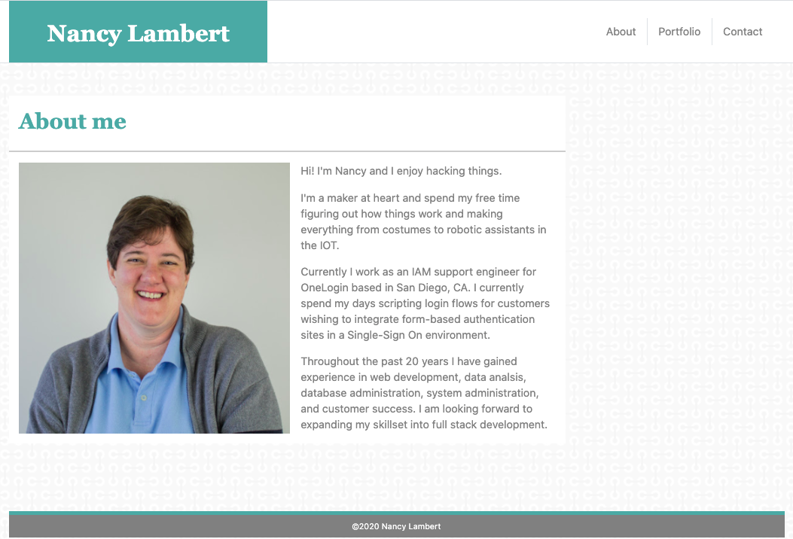

# Portfolio #

### Professional portfolio for Nancy Lambert ###

https://n-lambert.github.io/homework-week-2/

## Table Of Contents ##

- [Section 1: Introduction](#introduction)
- [Section 2: Usage](#usage)
- [Section 3: Credits](#credits)
- [Section 4: License](#license)

## Introduction ##

This is my professional portfolio. In it you'll find the projects I've been working on as well as a contact form and links to my social media. It is built using Bootstrap 4 and css and liberal doses of coffee.

## Usage ##

Anyone is free to find the source code here on GitHub. You can access the files through cloning the repo, and the link underneath the website screenshot will take you to the live page. It should be responsive on a wide variety of devices and browsers.

## Credits ##

BootStrap: https://getbootstrap.com/
Icon Finder: https://www.iconfinder.com/
Thank you to all the members of my study group for hours of working together!

## License ##

GNU General Public License